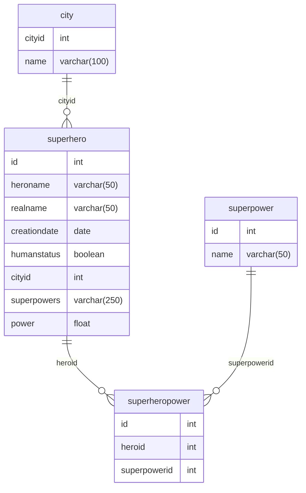

```mermaid
erDiagram
    city ||--o{ superhero : "cityid"
    city {
        cityid int
        name varchar(100)
    }
    superhero ||--o{ superheropower : "heroid"
    superhero {
        id int
        heroname varchar(50)
        realname varchar(50)
        creationdate date
        humanstatus boolean
        cityid int
        superpowers varchar(250)
        power float
    }
    superpower ||--o{ superheropower : "superpowerid"
    superpower {
        id int
        name varchar(50)
    }
    superheropower {
        id int
        heroid int
        superpowerid int
    }
```
